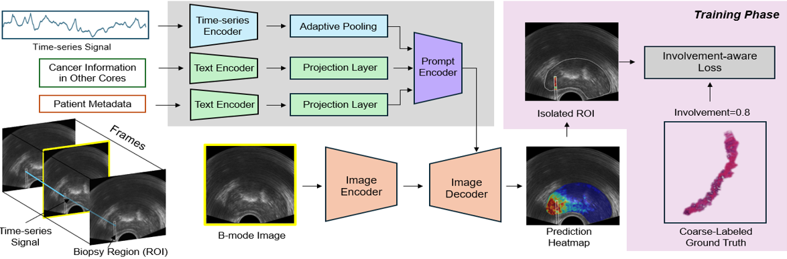
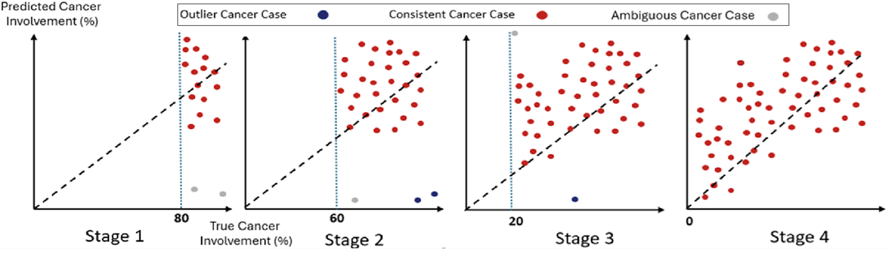
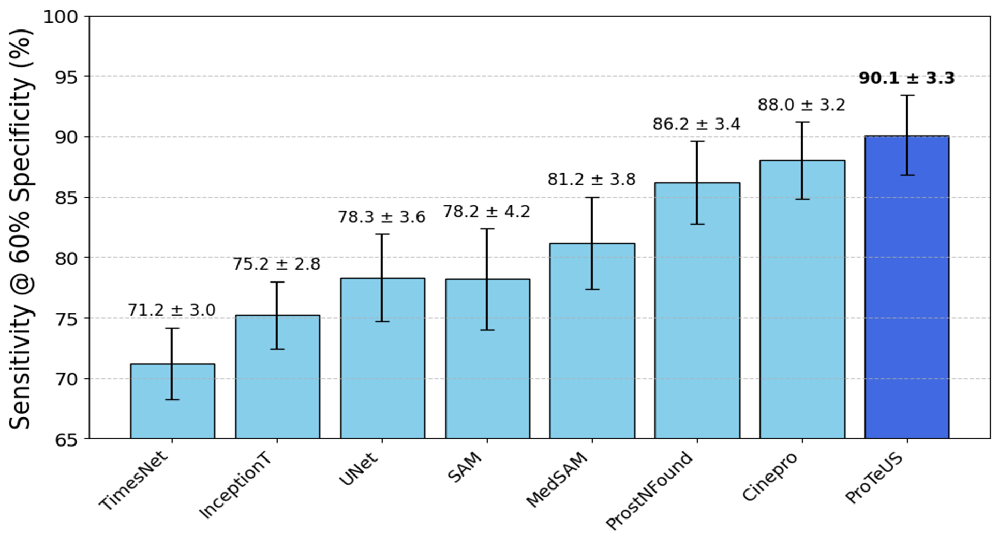
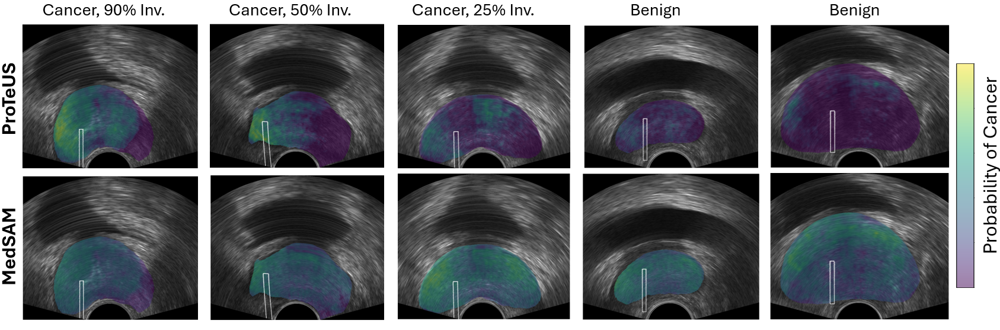

# ProTeUS: A Spatio-Temporal Enhanced Ultrasound-Based Framework for Prostate Cancer Detection  
**MICCAI 2025**


This repository is the **official implementation** of the MICCAI 2025 paper:  
[**ProTeUS: A Spatio-Temporal Enhanced Ultrasound-Based Framework for Prostate Cancer Detection**](https://link.springer.com/chapter/10.1007/978-3-032-04984-1_39) (Springer LNCS).



---

## Abstract
Deep learning holds significant promise for enhancing realtime ultrasound-based prostate biopsy guidance through precise and effective tissue characterization. Despite recent advancements, prostate
cancer (PCa) detection using ultrasound imaging still faces two critical challenges: (i) limited sensitivity to subtle tissue variations essential
for detecting clinically significant disease, and (ii) weak and noisy labeling resulting from reliance on coarse annotations in histopathological
reports. To address these issues, we introduce ProTeUS, an innovative
spatio-temporal framework that integrates clinical metadata with comprehensive spatial and temporal ultrasound features extracted by a foundation model. Our method includes a novel hybrid, cancer involvementaware loss function designed to enhance resilience against label noise and
effectively learn distinct PCa signatures. Furthermore, we employ a progressive training strategy that initially prioritizes high-involvement cases
and gradually incorporates lower-involvement samples. These advancements significantly improve the model’s robustness to noise and mitigate
the limitations posed by weak labels, achieving state-of-the-art PCa detection performance with an AUROC of 86.9%. 

---

## Highlights
- **Weak-label robust training**: involvement-aware objectives (iMSE / iMAE) and masked CE/GCE with **out-of-bounds penalties**.  
- **Anatomy-aware pooling**: predictions are aggregated **only** inside (prostate ∩ needle) regions.  
- **Prompted foundation model**: MedSAM + optional **RF time-series encoder** (Inception-Time) and **metadata encoder** (frozen PubMedBERT → small MLP).  
- **Progressive training strategy**: Progressive training strategy: four staged curricula that begin with high-involvement, low-noise cancer cores, then gradually introduce lower-involvement (noisier) cases. At each stage we flag high-loss samples as ambiguous, re-evaluate them in the next stage, and prune persistently inconsistent samples to stabilize learning. 


## Repository Map

├── src/ \
│ ├── train_proteus.py # ProTeUS training loop \
│ ├── train_unet.py # UNet baselines  \
│ ├── train_medsam.py # MedSAM baselines  \ 
│ ├── helpers/  \
│ │ ├── loss.py # iMSE/iMAE/CE/GCE/OBP + wrappers  \ 
│ │ └── masked_predictions.py# region-masked pooling  \
│ ├── models/  \ 
│ │ └── proteus.py # ProTeUS  (MedSAM backbone)  \
│ │ └── unet.py # UNet  \
│ │ └── inception_1d.py # InceptionTime  \
│ │ └── sam.py # SAM  \
│ └── utils.py # metrics & plotting  \
├── medAI/  \
│ └── datasets/  \
│ ├── data_bk.py # dataloaders  \
│ └── transforms.py # geometric + ultrasound-style augs  \
│ └── data_utils.py # tables, splits,  \
├── docs/assets/ # place paper figures here (PNGs)  \
├── requirements.txt  \
└── README.md  \


## Installation

### 1) Clone the repo
```
git clone https://github.com/your-org/ProTeUS.git
cd ProTeUS
 ```

### 2) (Recommended) Create and activate a clean environment
####    (Use either conda or venv)

#### --- conda ---
```
conda create -n proteus python=3.10 -y
conda activate proteus
```
#### --- OR: venv ---
```
python3 -m venv .venv
source .venv/bin/activate    # (Windows: .venv\Scripts\activate)
```
### 3) Install PyTorch first (pick the line that matches your CUDA/CPU setup)
CUDA 12.1:
`pip install --index-url https://download.pytorch.org/whl/cu121 torch torchvision torchaudio`

 CUDA 11.8:
`pip install --index-url https://download.pytorch.org/whl/cu118 torch torchvision torchaudio`

CPU only:
`pip install --index-url https://download.pytorch.org/whl/cpu torch torchvision torchaudio`

#### 4) Install this project (uses setup.py)
`pip install -e .`

## Data Assumptions

For each biopsy core: `BK_<CENTER>_CORES/` \
`patXXXX_corY_rf.npy `          RF cube (H×W×T) \
`patXXXX_corY_needle.npy `      needle mask (H×W) \
`patXXXX_corY_prostate.npy  `   prostate mask (H×W) \
`patXXXX_corY_info.json`        Pathology, Involvement, PSA, ...

A single B-mode image is derived on-the-fly from the RF cube (Hilbert amplitude → resize).  
Choose the frame policy via `data.frame_to_use`:

- `avg_all` • `first_frame` • `last_frame` • `random` • `random_avg`


## Quick Start

To train ProTeUS: 

`python run.py config/proteus.yaml`


## Progressive Training Strategy

<!-- Replace the image path with the location in your repo, e.g., `assets/progressive_training.png` -->
<p align="center">
  
</p>

**Four-stage curriculum:**
- **Stage 1:** Train on high-involvement cancer cores and benign cases; discard clear outliers (gray).
- **Stage 2:** Introduce mid-high involvement; re-check previously ambiguous samples.
- **Stage 3:** Add medium involvement; maintain a *re-evaluation buffer* for persistent high-loss samples.
- **Stage 4:** Incorporate low-involvement cases; finalize with full cohort while down-weighting unresolved ambiguities.

> *Blue points denote outliers; red points are consistent cancer cases. The dashed line is the ideal identity relation between predicted and true involvement.*


## Quantitative Results

<p align="center">
  
</p>

**Sensitivity @ 60% Specificity (%, mean ± SD)**

| Method       | Sens.@60% Spe. |
|--------------|-----------------|
| TimesNet     | **71.2 ± 3.0**  |
| InceptionT   | **75.2 ± 2.8**  |
| UNet         | **78.3 ± 3.6**  |
| SAM          | **78.2 ± 4.2**  |
| MedSAM       | **81.2 ± 3.8**  |
| ProstNFound  | **86.2 ± 3.4**  |
| Cinepro      | **88.0 ± 3.2**  |
| **ProTeUS**  | **90.1 ± 3.3**  |

> *Metric: Sensitivity at fixed 60% specificity, averaged over folds; error bars show standard deviation.*


---

## Qualitative Results


<p align="center">
  
</p>
**Panels (left → right):**
1. **Cancer, 90% Inv.** — High-intensity activations aligned with dense tumor region.
2. **Cancer, 50% Inv.** — Spatially mixed but consistent activations within the gland boundaries.
3. **Cancer, 25% Inv.** — Focal responses near suspected lesion, low diffuse noise.
4. **Benign** — Suppressed activations inside the prostate; needle region is clean.
5. **Benign** — Minimal off-target activity and no spurious hotspots.

> *Overlays are model logits (post-sigmoid) masked by prostate & needle regions for visibility.*


---

## Citation

Citation
If you use this code, please cite our paper:

```
@InProceedings{10.1007/978-3-032-04984-1_39,
author = {Elghareb, Tarek and Harmanani, Mohamed and To, Minh and Wilson, Paul and Jamzad, Amoon and Fooladgar, Fahimeh and Abdelsamad, Baraa and Dzikunu, Obed and Sojoudi, Samira and Reznik, Gabrielle and Leveridge, Michael and Siemens, Robert and Chang, Silvia and Black, Peter and Mousavi, Parvin and Abolmaesumi, Purang},
title="ProTeUS: A Spatio-Temporal Enhanced Ultrasound-Based Framework for Prostate Cancer Detection",
booktitle="Medical Image Computing and Computer Assisted Intervention -- MICCAI 2025",
year="2026",
publisher="Springer Nature Switzerland",
address="Cham",
pages="405--414",
abstract="Deep learning holds significant promise for enhancing real-time ultrasound-based prostate biopsy guidance through precise and effective tissue characterization. Despite recent advancements, prostate cancer (PCa) detection using ultrasound imaging still faces two critical challenges: (i) limited sensitivity to subtle tissue variations essential for detecting clinically significant disease, and (ii) weak and noisy labeling resulting from reliance on coarse annotations in histopathological reports. To address these issues, we introduce ProTeUS, an innovative spatio-temporal framework that integrates clinical metadata with comprehensive spatial and temporal ultrasound features extracted by a foundation model. Our method includes a novel hybrid, cancer involvement-aware loss function designed to enhance resilience against label noise and effectively learn distinct PCa signatures. Furthermore, we employ a progressive training strategy that initially prioritizes high-involvement cases and gradually incorporates lower-involvement samples. These advancements significantly improve the model's robustness to noise and mitigate the limitations posed by weak labels, achieving state-of-the-art PCa detection performance with an AUROC of 86.9{\%}. Our code is publicly accessible at https://github.com/DeepRCL/ProTeUS.",
isbn="978-3-032-04984-1"
}

```

